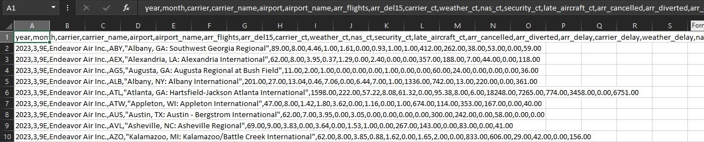
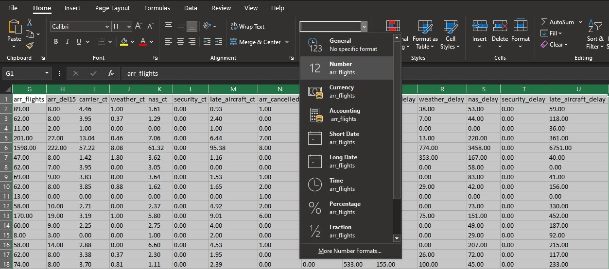
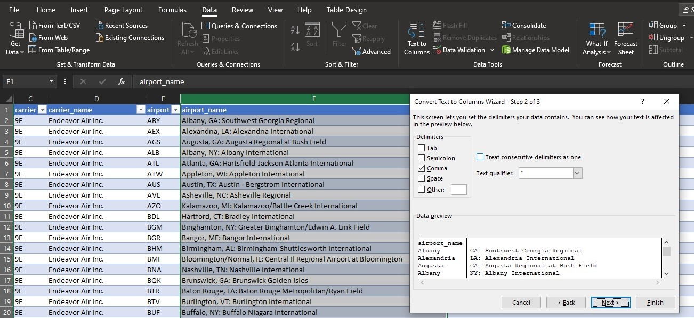
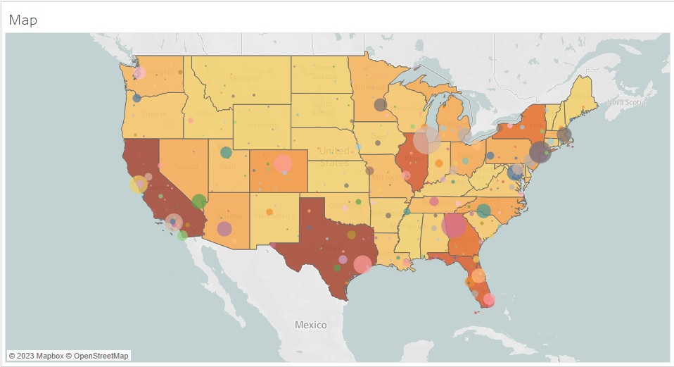
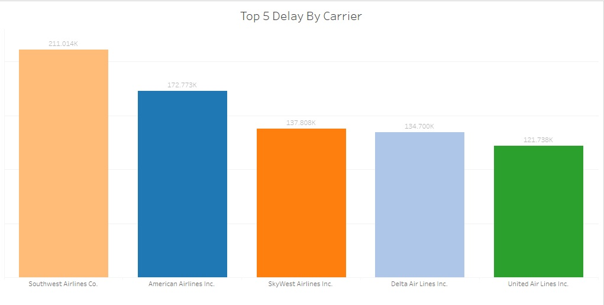
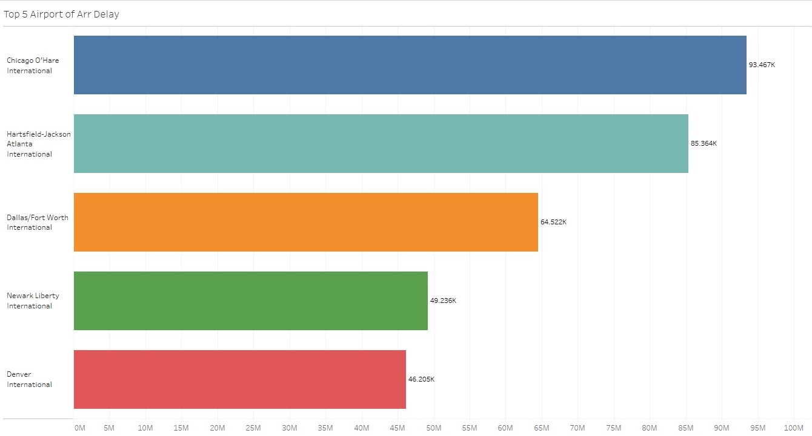
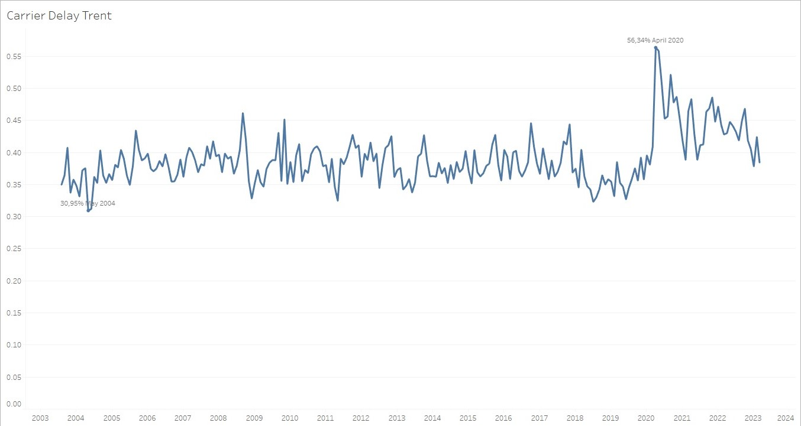
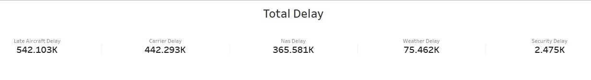
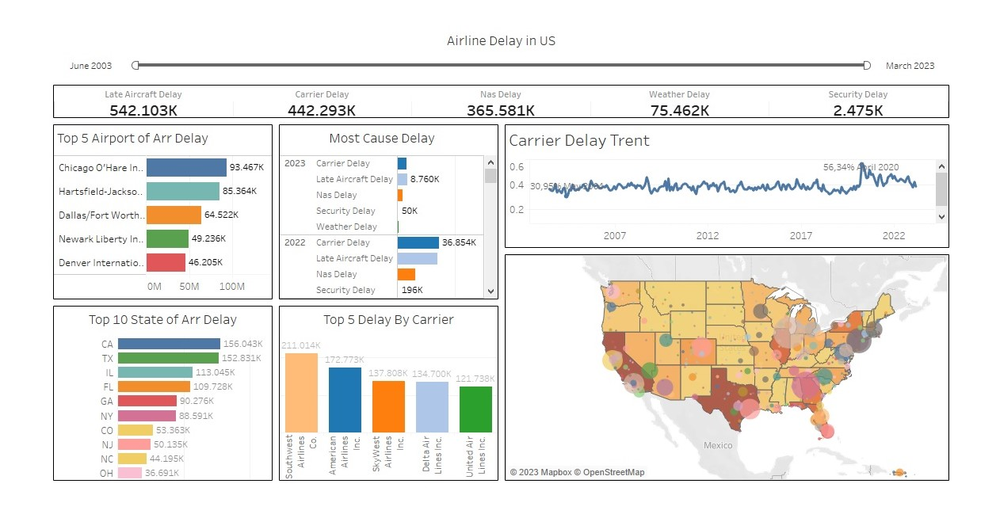

# Introduction

The U.S. Department of Transportation’s Bureau of Transportation Statistics (BTS) keeps an eye on how well big airlines are doing with their on-time flights within the country. They share a monthly report called the Air Travel Consumer Report, which tells us about the number of flights that were on time, delayed, canceled, or diverted. This report comes out about a month after each month ends, and you can also find summary tables on their website.

Starting from June 2003, BTS also started collecting information about what’s causing flight delays. And guess what? All this data is available to the public when they release the Air Travel Consumer Report. So if you want to know how flights are performing and why there might be delays, BTS has got all the info you need!

### Delay Problem
The airlines report the causes of delays in five broad categories:
- Air Carrier : The cause of the cancellation or delay was due to circumstances within the airline’s control (e.g. maintenance or crew problems, aircraft cleaning, baggage loading, fueling, etc.)
- Extreme Weather : Significant meteorological conditions (actual or forecasted) that, in the judgment of the carrier, delays or prevents the operation of a flight such as tornado, blizzard or hurricane.
- National Aviation System (NAS) : Delays and cancellations attributable to the national aviation system that refer to a broad set of conditions, such as non-extreme weather conditions, airport operations, heavy traffic volume, and air traffic control.
- Late-arriving aircraft : A previous flight with same aircraft arrived late, causing the present flight to depart late.
- Security : Delays or cancellations caused by evacuation of a terminal or concourse, re-boarding of aircraft because of security breach, inoperative screening equipment and/or long lines in excess of 29 minutes at screening areas.
 

This dataset may contain information on the names of airlines, the names of airports, the number of flights in each city and state, the number of flight delays on each airline, etc. I intend to evaluate this data to learn more about how big flight delays are and causes them.

Link [dataset](https://www.bts.dot.gov/)

## Objectives
- Delay problem : See how many flight delays there are for each delay problem
- Carrier Delay Trent : Graph of flight delays every year (July 2003 - March 2023)
- Airport delay : See the number of flight delays at each airport
- Most causes delay : see the most causes of delay for each year
- Flight delays on state : see how big the flight delays are in the state
- Delay by carrier : which airlines are experiencing the most delays

## My project will include the following steps:
- Data Collection: We’ll gather information from link dataset above, which provides the required datasets
- Data Preparation: We’ll get the data ready for analysis by cleaning and organizing it neatly.
- Exploring Data Analyst (EDA) : We will take a closer look at the data to see how flight delays are spread across all states and how much airline operators are experiencing delays
- Visualizing the Data: To make things easier to see and understand, we’ll create visual pictures (charts and graphs) that show us interesting things about the data, helping us find trends and patterns.

By following these steps, we’ll go from collecting the data to having a clear picture of what’s happening with airline delay

### 1. Data Collection

   The dataset we'll be using contains over 30,000 pieces of flight data such as airport name, airline name, city, state and more. We will dive into this data to find out what it means and how we can utilize it to find out the level of flight delays.
   Analyzing this data can help us find out which airline operators experience the biggest delays, which cities and states experience the most flight delays and see trends in flight delays from year to year.
   So, we're going to examine this data set, do some interesting analysis and data visualization. Let's get started because this is going to be pretty awesome. I will use Microsoft Excel to process the data I downloaded from the dataset link above.

   

   The following are the columns of the table :
   
   year ; month ; carrier ; carrier_name ; airport ; airport_name ; arr_flights ; arr_del15 ; carrier_ct ; weather_ct ; nas_ct ; security_ct ; late_aircraft_ct ; arr_cancelled ; arr_diverted ; arr_delay ; carrier_delay ; weather_delay ; nas_delay ; security_delay ; late_aircraft_delay

### 2. Data Preparation

   Before we begin data analysis and visualization, we must first ensure that our dataset is clean and correctly formatted. This is known as data preparation, and it consists of multiple steps:
   
   2.1 Data Inspection: We’ll begin by inspecting the dataset for missing values, duplicates, or inconsistent data. We will also verify that the data types are correct and that the dataset is ready for analysis.
   
   2.2 Data Cleaning: After that, we’ll clean the dataset by deleting or correcting any errors, inconsistencies, or irrelevant data. This will improve the dataset’s reliability and accuracy.
   
   2.3 Data Transformation: Once the dataset has been cleaned, it may be necessary to alter it to make it more relevant for analysis. Scaling, normalization, and feature engineering are examples of this.
   
   2.4 Data Saving: After we’ve prepared the data, we’ll save it in a new file to avoid overwriting the original dataset. We may always return to the original dataset if necessary.

   By following these processes, we can verify that our data is clean, correct, and ready for analysis

   Let's take a action
   - Check the data type
     We will change the data type containing number to number and string to text. and check for duplicate data
     
   - As we see in the airport_name column, there are state, city and airport names in one column. as an example : Albany, GA: Southwest Georgia Regional. we will separate this information into three sections. First we will separate the cities. by selecting text to columns on the Data tab
     
      - Do the same action for state and airport names
      - Remove empty spaces from the columns we have separated earlier. we will use the =TRIM formula on the empty columns
      - Combine two information into one column. as we see in column A (year) and B (month). we will combine the two information into one column by using function =Date(Year;Month;Date). However, because we don’t know what date it is, we assume it is the first date. Change date format to mmm-yy in formal cells
      - Remove all decimal numbers (.00) from all columns in the table
    
   - Because we just want to analyze the flight delay case, I will delete the columns from arr_flight to arr_diverted. Keep in mind, if there is data that you don’t know or don’t need to include in your analysis, then it is better to delete it, this will make your analysis more consistent.
   - Save our work in an excel file
  
### 3. Explorating Data Analyst (EDA)

   3.1 Create a map. The roundness of the city indicates the number of flight delays. the bigger the roundness the more delay. The darker the color in a state the more delay there is.
   

   As can be seen the city of Chicago is the city with the most flight delays.

   3.2 Delay by Carrier. We filtered only the top 5 flight delays.:airplane:
       

   Of the hundreds of flight operators, we can see that Southwest Airline Co. is the flight operator that has the most delays.

   3.3 Airport delays. We filtered only the top 5 airport delays.:airplane: 
       

   Chicago O'Hare International airport is the airport with the highest number of flight delays.

   3.4 Carrier delay trend. We display all data from June 2003 to March 2023.:airplane:
        
   April 2020 is the year with the highest average delay of 56.34%. This may be due to the covid-19 pandemic where almost all human movement is restricted.

   3.5 Total Delay. Displays all problem delays from June 2003 to March 2023.:airplane:
        

## Conclusions

1. The city of Chicago is the city with the most flight delays
2. Southwest Airline Co. is the flight operator that has the most delays
3. Chicago O'Hare International airport is the airport with the highest number of flight delays
4. April 2020 is the year with the highest average delay of 56.34%. This may be due to the covid-19 pandemic where almost all human movement is restricted
5. Total delay based on each problem :
   - Late aircraft delay = 542,103K
   - Carrier delay       = 442,293K
   - Nas delay           = 365,581K
   - Weather delay       = 75,462K
   - Security delay      = 2,475K

### The dashboard can be viewed by clicking :point_right: [Tableau Public](https://public.tableau.com/views/AirplaneDelayinUS/AirlineDelayinUS?:language=en-US&publish=yes&:display_count=n&:origin=viz_share_link) link

      

